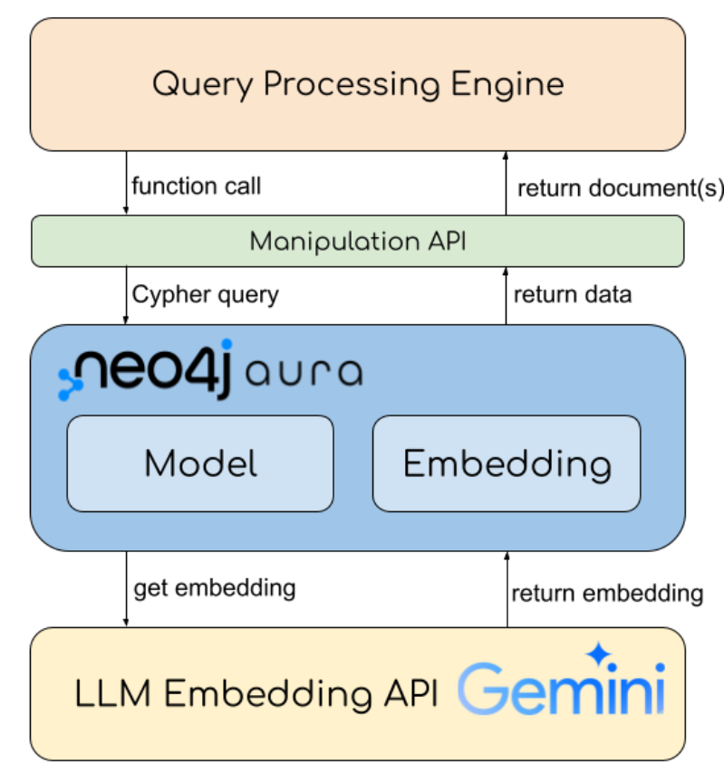

# Paper is all you need: A Graph Database to Manage Research Papers

Literature search can be a huge problem for beginners and proficient researchers in every field of study. Beginners may use imprecise keywords to search papers on Google Scholar, spend much time on reading seemingly relevant articles, and finally find that those contents do not meet their needs. Due to lacking certain domain knowledge, such phenomena are quite common and frustrating. Proficient researchers are also harassed by some everlasting problems: What papers reference this work? What institutes have published some research on this topic? Spending time on such issues is meaningless but critical during research. Hence, a solution to those common troubles is essential.

## Solution

In this project, we build a literature search and management system. It properly models document-related information and provides a natural language query interface. In particular, we leverage knowledge graph (KG) and its query techniques to instantiate such features. Besides, we perform link prediction to find the hidden relationships between keyword nodes. Also, we provide several direct and indirect query examples to demonstrate our search capability.

### Setting up the environment

```Python
conda create -n <env_name> python=3.10
conda activate <env_name>
pip install -r requirements.txt
```

### System Overview


